# LazyCaptcha

## 介绍

仿[EasyCaptcha](https://gitee.com/ele-admin/EasyCaptcha)和[SimpleCaptcha](https://github.com/1992w/SimpleCaptcha),基于.Net Standard 2.0 的图形验证码模块。
可运行在.Net Framework >= 4.6.1，Core >= 2.0 环境下。.Net Framework下使用，[请参照](#user-content-net-framwork下使用-)
>  v1.1.6版本开始支持.Net Standard 2.0，之前为.Net Standard 2.1，如果要在 .Net Framework中使用，请使用>=1.1.6版本。

 **滑动验证码请移步[lazy-slide-captcha](https://gitee.com/pojianbing/lazy-slide-captcha)。**   
[码云地址](https://gitee.com/pojianbing/lazy-captcha)
[Github 地址](https://github.com/pojianbing/LazyCaptcha)

### 效果展示

| CaptchaType           | 字体    | 静态图                                          | 动图                                            |
| --------------------- | ------- | ----------------------------------------------- | ----------------------------------------------- |
| DEFAULT (0)           | Actionj | 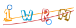           | 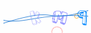           |
| CHINESE (1)           | kaiti   |            | 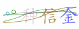           |
| NUMBER (2)            | Fresnel | 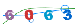            | 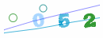            |
| NUMBER_ZH_CN (3)      | kaiti   |         |       |
| NUMBER_ZH_HK (4)      | kaiti   |       | 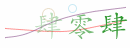      |
| WORD (5)              | Epilog  |               | 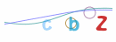              |
| WORD_LOWER (6)        | Epilog  |         | 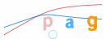        |
| WORD_UPPER (7)        | Epilog  |         | 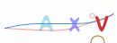        |
| WORD_NUMBER_LOWER (8) | Epilog  |  | 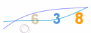 |
| WORD_NUMBER_UPPER (9) | Epilog  |  | 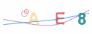 |
| ARITHMETIC (10)       | Epilog  | 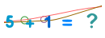        | 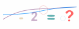        |
| ARITHMETIC_ZH (11)    | kaiti   | 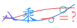     | 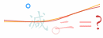     |

| 字体    | 图片                                     | 字体     | 图片                                      |
| ------- | ---------------------------------------- | -------- | ----------------------------------------- |
| Actionj | 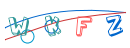 | Epilog   |    |
| Fresnel | 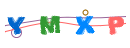 | Headache |  |
| Kaiti   |    | Lexo     | 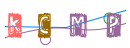     |
| Prefix  |   | Progbot  |   |
| Ransom  | 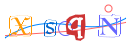  | Robot    | 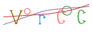    |
| Scandal |  |

### 在线演示（已停止服务）

```shell
# 此次返回的是 uyfx
http://wosperry.com.cn:8006/captcha?id=999

# 更改参数为对应的ID和图形上的验证码uyfx，通过则返回true
http://wosperry.com.cn:8006/captcha/validate?id=999&code=uyfx

```

### 安装

- [Package Manager](https://www.nuget.org/packages/Lazy.Captcha.Core)

```powershell
Install-Package Lazy.Captcha.Core
```

- [.NET CLI](https://www.nuget.org/packages/Lazy.Captcha.Core)

```powershell
dotnet add package Lazy.Captcha.Core
```

### 使用说明

#### 1. 注册服务

```csharp
// 默认使用内存存储（AddDistributedMemoryCache）
builder.Services.AddCaptcha(builder.Configuration);

// 如果使用redis分布式缓存
//builder.Services.AddStackExchangeRedisCache(options =>
//{
//    options.Configuration = builder.Configuration.GetConnectionString("RedisCache");
//    options.InstanceName = "captcha:";
//});

```

#### 2. 配置

##### appsettings.json （不提供配置时，使用默认配置）

```csharp
{
  "ConnectionStrings": {
    // 使用Redis缓存时，需要配置此项
    // 使用格式参考 Microsoft.Extensions.Caching.StackExchangeRedis
    "RedisCache": "localhost,password=Aa123456."
  },
  "CaptchaOptions": {
    "CaptchaType": 5, // 验证码类型
    "CodeLength": 4, // 验证码长度, 要放在CaptchaType设置后  当类型为算术表达式时，长度代表操作的个数
    "ExpirySeconds": 60, // 验证码过期秒数
    "IgnoreCase": true, // 比较时是否忽略大小写
    "StoreageKeyPrefix": "", // 存储键前缀
    "ImageOption": {
      "Animation": false, // 是否启用动画
      "FontSize": 32, // 字体大小
      "Width": 100, // 验证码宽度
      "Height": 40, // 验证码高度
      "BubbleMinRadius": 5, // 气泡最小半径
      "BubbleMaxRadius": 10, // 气泡最大半径
      "BubbleCount": 3, // 气泡数量
      "BubbleThickness": 1.0, // 气泡边沿厚度
      "InterferenceLineCount": 4, // 干扰线数量
      "FontFamily": "kaiti", // 包含actionj,epilog,fresnel,headache,lexo,prefix,progbot,ransom,robot,scandal,kaiti
      "FrameDelay": 15, // 每帧延迟,Animation=true时有效, 默认30
      "BackgroundColor": "#ffff00", //  格式: rgb, rgba, rrggbb, or rrggbbaa format to match web syntax, 默认#fff
      "ForegroundColors": "" //  颜色格式同BackgroundColor,多个颜色逗号分割，随机选取。不填，空值，则使用默认颜色集
    }
  }
}
```

##### 代码配置

``` c#
// 全部配置
builder.Services.AddCaptcha(builder.Configuration, option =>
{
    option.CaptchaType = CaptchaType.WORD; // 验证码类型
    option.CodeLength = 6; // 验证码长度, 要放在CaptchaType设置后.  当类型为算术表达式时，长度代表操作的个数
    option.ExpirySeconds = 30; // 验证码过期时间
    option.IgnoreCase = true; // 比较时是否忽略大小写
    option.StoreageKeyPrefix = ""; // 存储键前缀

    option.ImageOption.Animation = true; // 是否启用动画
    option.ImageOption.FrameDelay = 30; // 每帧延迟,Animation=true时有效, 默认30

    option.ImageOption.Width = 150; // 验证码宽度
    option.ImageOption.Height = 50; // 验证码高度
    option.ImageOption.BackgroundColor = SixLabors.ImageSharp.Color.White; // 验证码背景色

    option.ImageOption.BubbleCount = 2; // 气泡数量
    option.ImageOption.BubbleMinRadius = 5; // 气泡最小半径
    option.ImageOption.BubbleMaxRadius = 15; // 气泡最大半径
    option.ImageOption.BubbleThickness = 1; // 气泡边沿厚度

    option.ImageOption.InterferenceLineCount = 2; // 干扰线数量

    option.ImageOption.FontSize = 36; // 字体大小
    option.ImageOption.FontFamily = DefaultFontFamilys.Instance.Actionj; // 字体
    
    /* 
     * 中文使用kaiti，其他字符可根据喜好设置（可能部分转字符会出现绘制不出的情况）。
     * 当验证码类型为“ARITHMETIC”时，不要使用“Ransom”字体。（运算符和等号绘制不出来）
     */
});
```

#### 3. Controller

```csharp

[Route("captcha")]
[ApiController]
public class CaptchaController : Controller
{
    private readonly ICaptcha _captcha;

    public CaptchaController(ICaptcha captcha)
    {
        _captcha = captcha;
    }

    [HttpGet]
    public IActionResult Captcha(string id)
    {
        var info = _captcha.Generate(id);
        // 有多处验证码且过期时间不一样，可传第二个参数覆盖默认配置。
        //var info = _captcha.Generate(id,120);
        var stream = new MemoryStream(info.Bytes);
        return File(stream, "image/gif");
    }

    /// <summary>
    /// 演示时使用HttpGet传参方便，这里仅做返回处理
    /// </summary>
    [HttpGet("validate")]
    public bool Validate(string id, string code)
    {
        return _captcha.Validate(id, code);
    }

    /// <summary>
    /// 多次校验（https://gitee.com/pojianbing/lazy-captcha/issues/I4XHGM）
    /// 演示时使用HttpGet传参方便，这里仅做返回处理
    /// </summary>
    [HttpGet("validate2")]
    public bool Validate2(string id, string code)
    {
        return _captcha.Validate(id, code, false);
    }
}
```

### 自定义随机验证码（需要版本1.1.2）
动图和静态图随机出现， CaptchaType随机。
#### 1. 自定义RandomCaptcha
```csharp
/// <summary>
/// 随机验证码
/// </summary>
public class RandomCaptcha : DefaultCaptcha
{
    private static readonly Random random = new();
    private static readonly CaptchaType[] captchaTypes = Enum.GetValues<CaptchaType>();

    public RandomCaptcha(IOptionsSnapshot<CaptchaOptions> options, IStorage storage) : base(options, storage)
    {
    }

    /// <summary>
    /// 更新选项
    /// </summary>
    /// <param name="options"></param>
    protected override void ChangeOptions(CaptchaOptions options)
    {
        // 随机验证码类型
        options.CaptchaType = captchaTypes[random.Next(0, captchaTypes.Length)];

        // 当是算数运算时，CodeLength是指运算数个数
        if (options.CaptchaType.IsArithmetic())
        {
            options.CodeLength = 2;
        }
        else
        {
            options.CodeLength = 4;
        }

        // 如果包含中文时，使用kaiti字体，否则文字乱码
        if (options.CaptchaType.ContainsChinese())
        {
            options.ImageOption.FontFamily = DefaultFontFamilys.Instance.Kaiti;
            options.ImageOption.FontSize = 24;
        }
        else
        {
            options.ImageOption.FontFamily = DefaultFontFamilys.Instance.Actionj;
        }

        // 动静随机
        options.ImageOption.Animation = random.Next(2) == 0;

        // 干扰线随机
        options.ImageOption.InterferenceLineCount = random.Next(1, 4);

        // 气泡随机
        options.ImageOption.BubbleCount = random.Next(1, 4);

        // 其他选项...
    }
}
```

#### 2. 注入RandomCaptcha
```csharp
// 内存存储， 基于appsettings.json配置
builder.Services.AddCaptcha(builder.Configuration);
// 如果开启随机验证码，请打开下面的注释即可。
// builder.Services.Add(ServiceDescriptor.Scoped<ICaptcha, RandomCaptcha>());
```
> RandomCaptcha不包含在类库内部，仅做自定义演示，您可以根据自己的喜好，随机所有的CaptchaOptions值。

### 自定义字体

#### 1. 寻找字体
你可以通过[fontspace](https://www.fontspace.com/new/fonts)找到自己喜爱的字体。

#### 2. 将字体放入项目，并设置为嵌入资源。
> 当然也可以不作为嵌入资源，放到特定目录也是可以的，只要对下边ResourceFontFamilysFinder稍作修改即可。  

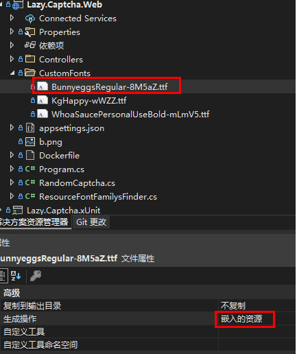

#### 3. 定义查找字体帮助类，示例使用ResourceFontFamilysFinder
```csharp
public class ResourceFontFamilysFinder
{
    private static Lazy<List<FontFamily>> _fontFamilies = new Lazy<List<FontFamily>>(() =>
    {
        var fontFamilies = new List<FontFamily>();
        var assembly = Assembly.GetExecutingAssembly();
        var names = assembly.GetManifestResourceNames();

        if (names?.Length > 0 == true)
        {
            var fontCollection = new FontCollection();
            foreach (var name in names)
            {
                if (!name.EndsWith("ttf")) continue;
                fontFamilies.Add(fontCollection.Add(assembly.GetManifestResourceStream(name)));
            }
        }

        return fontFamilies;
    });


    public static FontFamily Find(string name)
    {
        return _fontFamilies.Value.First(e => e.Name == name);
    }
}
```

#### 4. 设置option
``` c#
// 内存存储， 基于appsettings.json配置
builder.Services.AddCaptcha(builder.Configuration, options =>
{
    // 自定义字体
    options.ImageOption.FontSize = 28;
    options.ImageOption.FontFamily = ResourceFontFamilysFinder.Find("KG HAPPY"); // 字体的名字在打开ttf文件时会显示
});
```

### .Net Framework下使用 <a id="framework"></a> 
新建mvc项目，.Net Framework选择4.6.1。

#### 1. Nuget安装
先安装SixLabors.ImageSharp.Drawing  **1.0.0-beta14**

再安装Lazy.Captcha.Core **1.1.6**

#### 2. Global.asax增加
``` c#
public class MvcApplication : System.Web.HttpApplication
{
    protected void Application_Start()
    {
        AreaRegistration.RegisterAllAreas();
        FilterConfig.RegisterGlobalFilters(GlobalFilters.Filters);
        RouteConfig.RegisterRoutes(RouteTable.Routes);
        BundleConfig.RegisterBundles(BundleTable.Bundles);
        CaptchaConfig();
    }

    private void CaptchaConfig()
    {
        var captchaService = CaptchaServiceBuilder
            .New()
            .Width(98)
            .Height(35)
            .FontSize(20)
            .CaptchaType(CaptchaType.ARITHMETIC)
            .FontFamily(DefaultFontFamilys.Instance.Ransom)
            .InterferenceLineCount(3)
            .Animation(false)
            .Build();
        CaptchaHelper.Initialization(captchaService);
    }
}
```

#### 3. Controller使用
``` c#
public class CaptchaController : Controller
{
    [HttpGet]
    public ActionResult Index()
    {
        var id = Guid.NewGuid().ToString().Replace("_", "").Replace("-", "");
        var captchaData = CaptchaHelper.Generate(id);
        var output = new CaptchaResponse
        {
            Id = id,
            Base64 = captchaData.Base64
        };
        return Json(output, JsonRequestBehavior.AllowGet);
        
    }

    /// <summary>
    /// 演示时使用HttpGet传参方便，这里仅做返回处理
    /// </summary>
    [HttpGet()]
    public bool Validate(string id, string code)
    {
        return CaptchaHelper.Validate(id, code);
    }
}

public class CaptchaResponse
{
    public string Id { get; set; }
    public string Base64 { get; set; }
}
```

具体示例请参照 [Sample.MvcFramework](Sample.MvcFramework)项目。

### 版本历史

#### v1.1.6
-  新增Framework支持

#### v1.1.5
-  修复校验接口code传入null返回为true的bug

#### v1.1.4
-  优化干扰线显示，多条时适当分散
-  增加前景色配置ForegroundColors
-  优化部分代码

#### v1.1.3
-  ImageSharp升级到2.1.0

#### v1.1.2

- 改进DefaultCaptcha以方便自定义验证码。

#### v1.1.1

- 多次验证实现

#### v1.1.0

- 新增 FrameDelay 参数，控制每帧延迟，Animation = true 时有效。
- BackgroundColor 参数支持配置文件设置。
